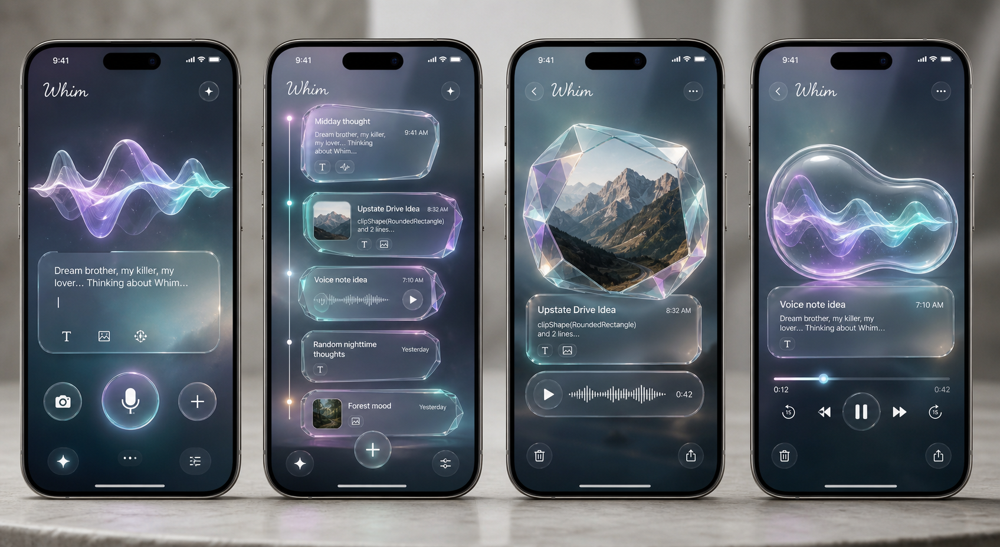

# Futuristic Glass Memory Objects

This proposal explores Whim as a space of captured thought fragments: text, image, and audio moments suspended in a soft futuristic atmosphere.

Entries feel like memory objects made from glass, light, sound, and image. The interface should feel calm, luminous, and expressive while staying easy to scan.

## Design Intent

- Captured entries feel alive, tactile, and lightly suspended.
- Translucent glass, prismatic edges, soft depth, and atmospheric gradients define the visual language.
- Text remains readable and spacious.
- Capture feels futuristic, immediate, and emotionally expressive.
- Browsing feels calm, cinematic, and easy to return to.

## Entry List Direction

- Newest entries appear as the most present fragments.
- A thin luminous timeline gives the list a sense of flow.
- Cards float with subtle horizontal offsets and depth.
- Text, image, and audio sit in connected glass modules.
- Audio is represented with fluid waveform shapes.
- Image entries feel like memory shards: organic, softly framed, and luminous.

## Prototype Notes

- Static prototype for exploring visual language.
- Useful for comparing parallel design directions.
- Animation, haptics, and transitions can build on this material language later.
